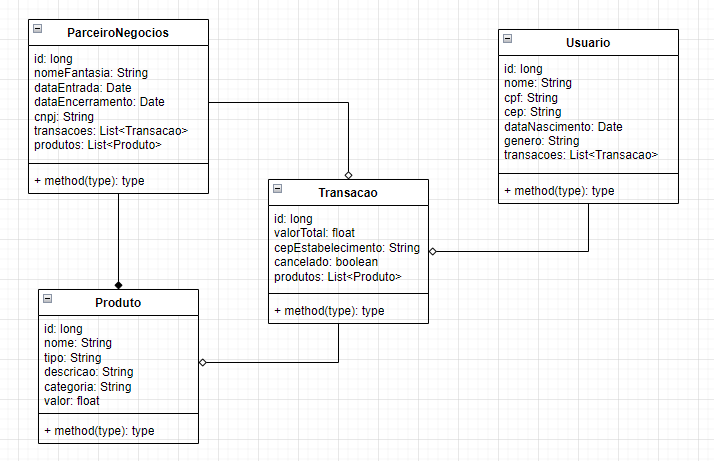

# DIGITAL BUSINESS ENABLEMENT

A primeira entrega será composta por 2 artefatos:
 - Vídeo Pitch com duração máxima de 7 minutos apresentação a proposta da solução. O vídeo deve informar o problema, a solução e as tecnologias que serão utilizadas.
 - Documentação da API, com uma lista de endpoints, verbos e códigos de status.

Envie o link do vídeo e um documento (pdfou md) com as definições da API.

## Diagrama de Classes (NÃO FINALIZADO)


## Endpoints
- Voos
  - [Cadastrar](#cadastrar-voo)
  - [Listar Todos](#listar-voos)
  - [Apagar](#apagar-voo)
  - [Atualizar](#atualizar-voo)
  - [Detalhes](#detalhar-voo)
- User
  - [Cadastrar](#cadastrar-user)
  - [Login](#login-user)

### Cadastrar Voo

`POST` /myflights/api/voo

*Campos de requisição*
| campo | tipo | obrigatório | derscrição
|-------|------|:-------------:|------------
|numVoo|int|sim| Número indentificador do Voo
|horario|data|sim| Horário do Voo
|destino|string|sim| Destino do Voo
|portao|int|nao| Portão que o passageiro deve se direcionar para embarcação

*Exemplo de requisição*
```
{
  "numVoo": 1364,
  "horario": '2023-12-27T10:30',
  "destino": 'New York',
  "portao": 12
}
```

*Resposta*
| código | descrição
|--------|-----------
|201| o voo foi cadastrado com sucesso
|400| dados inválidos

### Listar Voos

`GET` /myflights/api/voo

*Exemplo de resposta*
```
[
  {
    "numVoo": 1364,
    "horario": '2023-12-27T10:30',
    "destino": 'New York',
    "portao": 12
  },
  {
    "numVoo": 2934,
    "horario": '2023-12-28T20:00',
    "destino": 'Rio de Janeiro',
    "portao": 6
  },
]
```

*Resposta*
| código | descrição
|--------|-----------
|200| os dados foram retornados com sucesso

### Apagar Voo

`DELETE` /myflights/api/voo/{id}

*Resposta*
| código | descrição
|--------|-----------
|200| o voo foi removido com sucesso
|404| não foi possível achar um voo com esse id

### Atualizar Voo

`PUT` /myflights/api/voo/{id}

*Campos de requisição*
| campo | tipo | obrigatório | derscrição
|-------|------|:-------------:|------------
|numVoo|int|sim| Número indentificador do Voo
|horario|data|sim| Horário do Voo
|destino|string|sim| Destino do Voo
|portao|int|nao| Portão que o passageiro deve se direcionar para embarcação

*Exemplo de requisição*
```
{
  "numVoo": 1364,
  "horario": '2023-12-27T10:30',
  "destino": 'New York',
  "portao": 12
}
```

*Resposta*
| código | descrição
|--------|-----------
|200| o voo foi atualizado com sucesso
|404| não foi possível achar um voo com esse id

### Detalhar Voo

`GET` /myflights/api/voo/{id}

*Exemplo de resposta*
```
{
  "numVoo": 1364,
  "horario": '2023-12-27T10:30',
  "destino": 'New York',
  "portao": 12
}
```

*Resposta*
| código | descrição
|--------|-----------
|200| o voo foi detalhado com sucesso
|404| não foi possível achar um voo com esse id

### Cadastrar User

`POST` /myflights/api/user

*Campos de requisição*
| campo | tipo | obrigatório | derscrição
|-------|------|:-------------:|------------
|name|string|sim| Nome do usuário
|email|string|sim| Email do usuário
|senha|string|sim| Senha do usuário

*Exemplo de requisição*
```
{
  name:'Henry Rodrigues Kinoshita',
  email:'kinoshitahenry@gmail.com',
  senha:'**************'
}
```

*Resposta*
| código | descrição
|--------|-----------
|201| o user foi cadastrado com sucesso
|400| dados inválidos

### Login User

`POST` /myflights/api/user/login

*Campos de requisição*
| campo | tipo | obrigatório | derscrição
|-------|------|:-------------:|------------
|email|string|sim| Email do usuário
|senha|string|sim| Senha do usuário

*Exemplo de requisição*
```
{
  email:'kinoshitahenry@gmail.com',
  senha:'**************'
}
```

*Resposta*
| código | descrição
|--------|-----------
|201| o user foi cadastrado com sucesso
|400| dados inválidos
