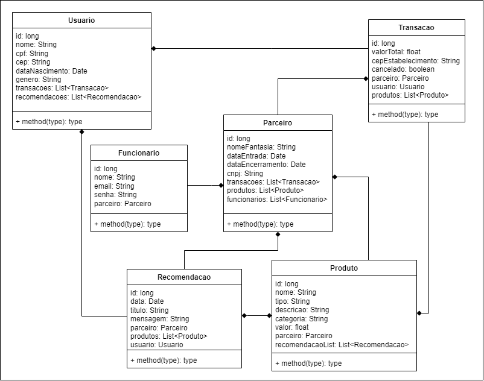

# AI Shopping Buddy

## Descrição do problema a resolver:
A jornada do cliente (CX) é uma parte crucial do sucesso de qualquer negócio. No entanto, muitas empresas lutam para fornecer uma experiência personalizada e satisfatória para seus clientes. O problema é a falta de uma solução eficiente para fornecer recomendações personalizadas e prever as necessidades dos clientes com base em seu histórico de compras e interações anteriores com a marca.

## Descrição da Solução:
Nossa solução propõe facilitar a criação de recomendações de produtos para consumidores, baseado em um modelo de machine learning (não implementado pela falta de um dataset disponível no mercado e foi acordado previamente), é possível a criação de uma recomendação apenas selecionando o consumidor e os produtos que deseja recomendar, e as mensagens são todas geradas por uma inteligência artificial.

## Funcionalidades
 - Cadastro de Parceiros, Funcionários, Usuários e Produtos
 - Criações de Recomendações com IA
 - Execução de Requisições com Swagger
 - Listagem e Detalhamento de todas entidades
 - Edição e Deleção de todas entidades
 - Testes de Integração

## Tecnologias Ultilizadas
 - API:
   - Java
   - Spring Boot
   - API do ChatGPT
   - Oracle Database
 - Aplicação Mobile:
   - Javascript
   - React Native

## Diagrama de Classes


## Vídeos executando a solução
[API e App Mobile](https://youtu.be/WvpQBQD26bg)
[Testes](https://youtu.be/Lh6bbRnO37M)
[Colocando a solução em Nuvem](https://youtu.be/1C-lnixkcuE)

## Configurações e Executando
1. Clone os repositórios:
    - [API](https://github.com/PEROLOKO/aishoppingbuddy)
    - [Aplicação Mobile](https://github.com/PEROLOKO/aishoppingbuddy_mobile_app)
2. No repositório da API em `..\aishoppingbuddy\src\main\resources` crie um arquivo `application.properties` com essas configurações:
```
# OracleDB connection settings
spring.datasource.url=jdbc:oracle:thin:@oracle.fiap.com.br:1521:ORCL
spring.datasource.username=RM93443
spring.datasource.password=220504
spring.datasource.driver-class-name=oracle.jdbc.OracleDriver

# JPA settings
spring.jpa.database-platform=org.hibernate.dialect.Oracle12cDialect
spring.jpa.hibernate.use-new-id-generator-mappings=false
spring.jpa.hibernate.ddl-auto=create
spring.jpa.show-sql=true

apiKey=[SUA API DO CHATGPT]
```
3. Execute a API
4. Quando a API finalizar sua inicialização você poderá iniciar a aplicação mobile
5. Para iniciar o app na pasta do repositório do app execute `npx react-native run-android`, certifique que você possuí um emulador android disponível e o node.js instalado em sua máquina
6. Ao executar o app você poderá fazer o cadastro inicial de um funcionários (para cadastrar um funcionário é necessário uma empresa parceira já no banco, e quando a aplicação é iniciada **já existe um parceiro no banco com ID#1** para esse cadastro inicial)
7. Ao fazer o cadastro é necessário fazer o login do funcionário que cadastrou
8. Para criar uma recomendação é necessário cadastrar pelo menos 1 usuário e 1 produto, e para cadastrá-los apenas clique nos botões de cadastrar produto e cadastrar usuário
9. Na criação de uma recomendação você deve selecionar o usuário que você criou e selecionar os produtos que deseja recomendar
10. Após clicar em gerar recomendação a API irá fazer um request na API do ChatGPT e poderá demorar alguns segundos.
11. E por fim após a recomendação ser criada você poderá ver todas as recomendações criadas em Todas as recomendações

## Integrantes
 - Enzo Perazolo RM95657
 - Giovanna Sousa RM94767
 - Henry Kinoshita RM93443
 - Luiz Felipe Souza de Oliveira RM94538
 - Matheus Felipe RM93772
 - Victor Mendes RM92843

## License
Veja o [LICENSE](LICENSE.txt) para direitos de licença e limitações (MIT)